== ПРАКТИКА ПО SQL SMS ==

Я добавляла данные в таблицы нейронкой чтобы долго с этим не возиться...

таблицы с данными:
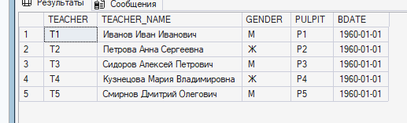

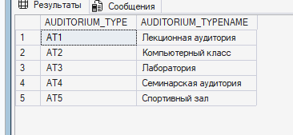
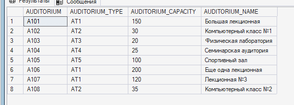

ПРАКТИКА

1. Выводим пару таблиц из всех.
    

2. Меняем таблицу
    1. Изначальная талблица
    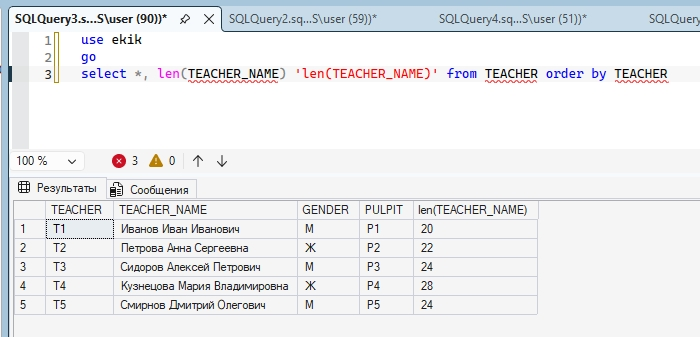
    2. Команда изменения строки и добавлеия нового столбца
    
    3. Смотрим на результат
    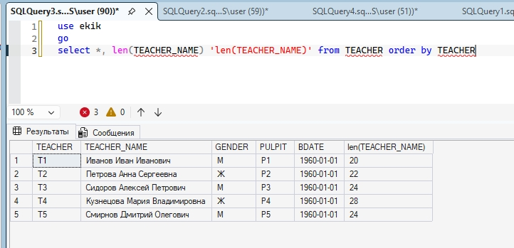

3. Группируем данные по столбцам и выводим.
    

4. Считаем места
    1. У меня AUDOTIRY_CAPACITY в AODITORIUM был с типом char, поэтому пришлось менять на int (иначе не считало)
    
    2. Считаем... Вывод: общее количество мест в аудиториях + количество аудиторий + средняя вместимость аудиторий + кол-во аудиторий, где вместимость выше средней + количество в процентах аудиторий, где вместимость выше средней
    

5. BEGIN-END
    1. Код
    declare - объявляем переменную, потом в блоке BEGIN-END выводим их на экран, преобразуя из int в char
    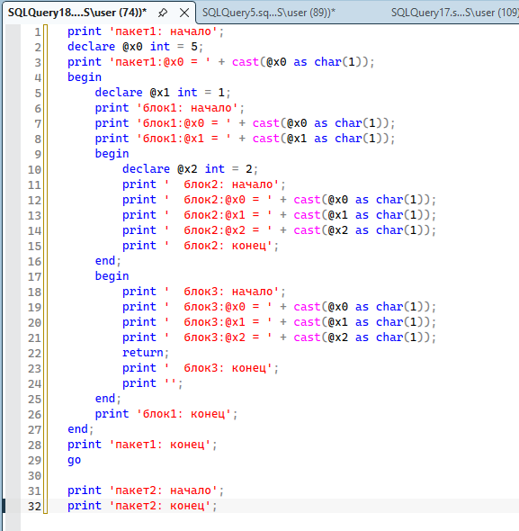
    2. Вывод
    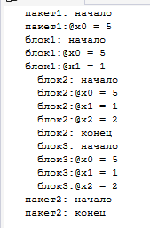

6. BEGIN-END
    1. Похоже на задание 4, но тут в выводе пишется только процент аудиторий, вместимость которых больше средней
    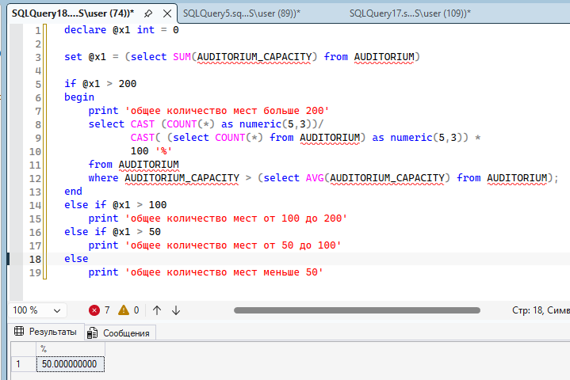

7. IF-ELSE
    1. Проверяем, есть ли в таблице строки. У меня в pulpit есть строки, а в student нет, поскольку я с этой таблицей не работала ещё....
    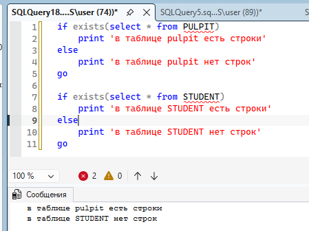
8. IF-ELSE
    1. Считаем количество мест в аудиториях и в зависимости от результата выводим строку
    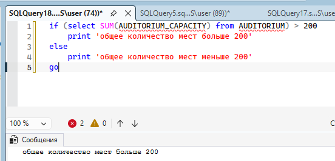

    я пропустила один слайд с IF-ELSE, чтобы успеть до конца пары посмотреть на применение CASE

9. CASE
    1. Идёт сверху-вниз и выбирает один из подходящих варинатов - после этого прерывает просмотр остальных кейсов
    1 кейс правильный - выводит его
    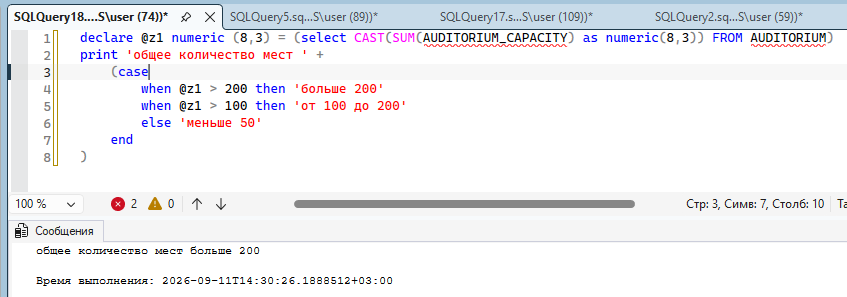
    1 кейс неправильный - пропускает. 2 кейс правильный - выводит
    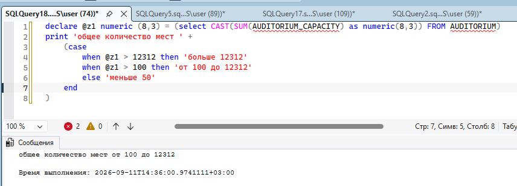