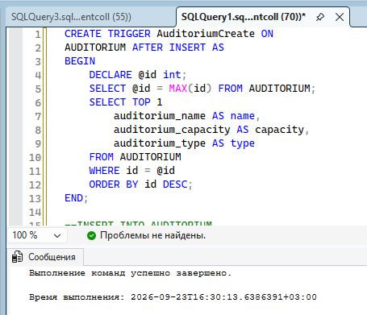
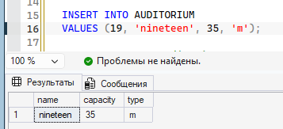
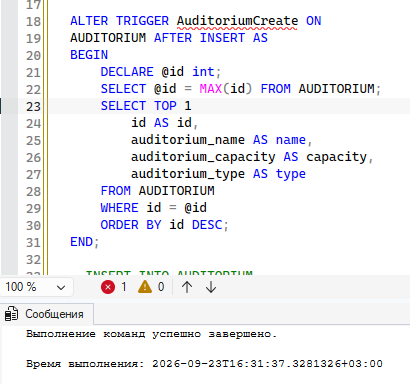
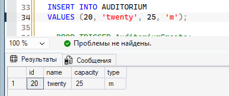
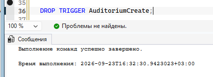
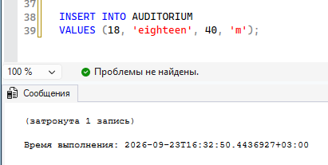
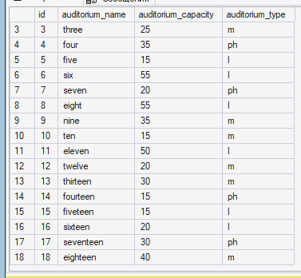
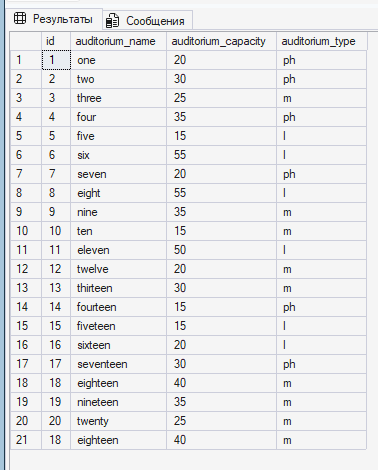

== ПРАКТИКА НА ЗАНЯТИИ ==

Триггер на таблицу:

1. Создаём триггер

2. Проверка триггера

3. Изменение триггера

4. Проверка изменения

5. Удаление триггера

6. Проверка удаления

Таблица до имзенений

Таблица после измнений

Я забыла поменять данные на нормальные, так что после 20 идёт опять 18... не суть, на задание это не влияет :^