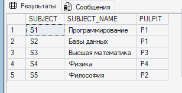
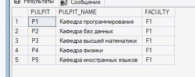
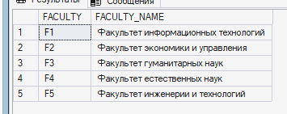
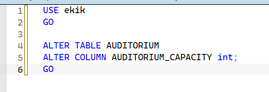
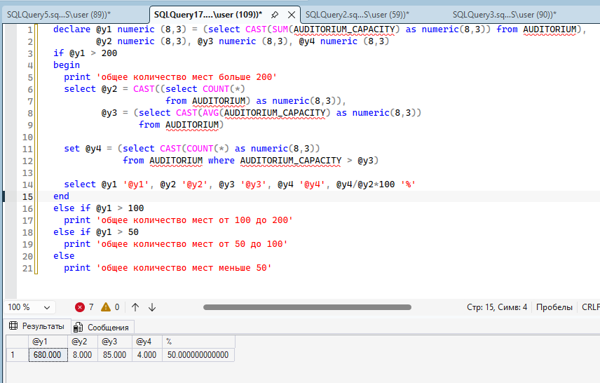

== ПРАКТИКА ПО SQL SMS ==

Я добавляла данные в таблицы нейронкой чтобы долго с этим не возиться...

таблицы с данными:

ПРАКТИКА

1. Выводим пару таблиц из всех.
    

2. Меняем таблицу
    1. Изначальная талблица
    
    2. Команда изменения строки и добавлеия нового столбца
    
    3. Смотрим на результат
    

3. Группируем данные по столбцам и выводим.
    

4. Считаем места
    1. У меня AUDOTIRY_CAPACITY в AODITORIUM был с типом char, поэтому пришлось менять на int (иначе не считало)
    
    2. Считаем...
    