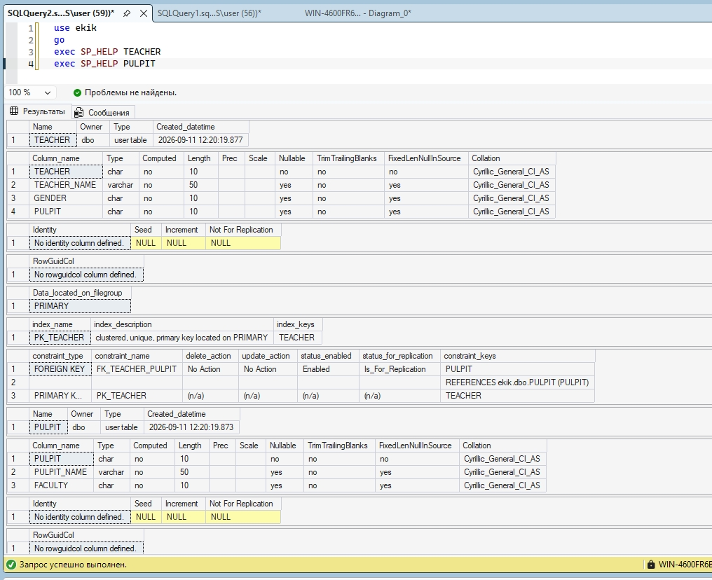
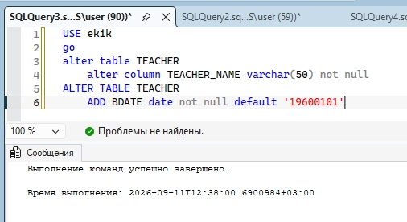
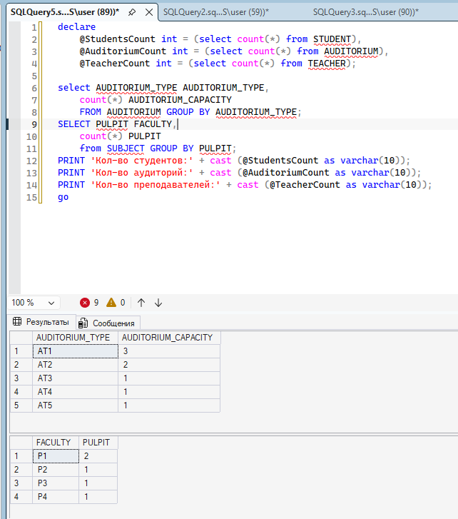

1. Выводим пару таблиц из всех.
    

2. Меняем таблицу
    1. Изначальная талблица
    
    2. Команда изменения строки и добавлеия нового столбца
    
    3. Смотрим на результат
    

3. Группируем данные по столбцам и выводим.
    