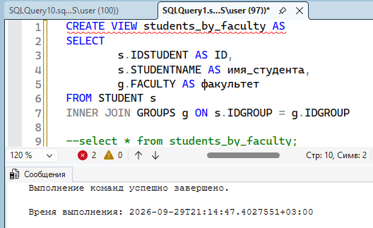
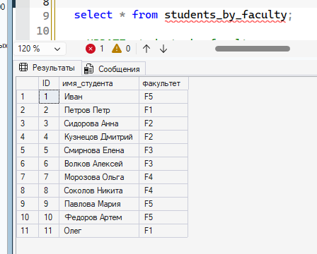
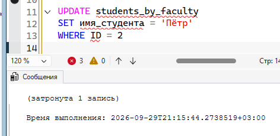
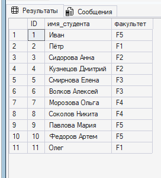
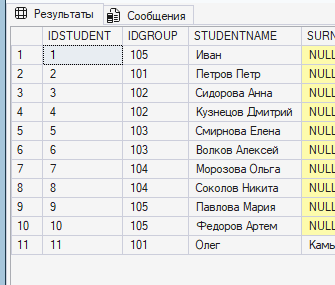
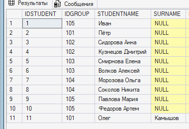
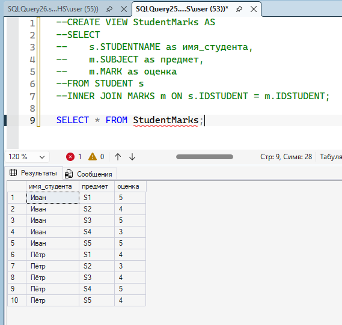
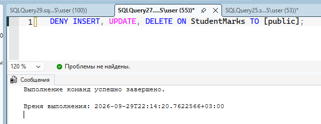
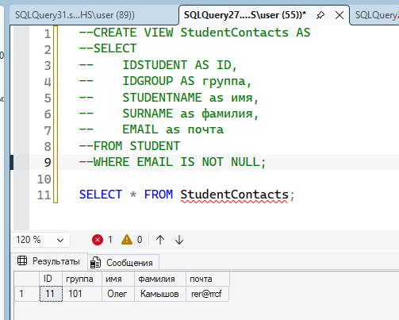

== ПРЕДСТАВЛЕНИЕ 1 ==

1. Создание представления

2. Просмотр представления

3. Изменение представления

4. Представление после изменения

Оригинальная таблица STUDENT до изменения:

После изменения:

Таким образом мы доказываем, что представление является модифицируемым: при изменении данных в представлении, меняеются соответствующие данные в оригинальной таблице.
Насколько я поняла, в SMS SQL нельзя создать НЕмодифицируемое представление (технически можно ограничить возможность редактирования через права доступа, но это уже немного другое), так что следующие 2 представления тоже являются модифицируемыми.

== ПРЕДСТАВЛЕНИЕ 2 ==

1. Создание и просмотр представления

я тут пыталась убрать права на редактирование, но поскольку я админ то я всё равно могу редактировать даже под запретом... ну крч по идее оно должно быть немодифицируемым хз

== ПРЕДСТАВЛЕНИЕ 3 ==

1. Создание и просмотр представления
