Принципы системы безопасности серверов БД

1. Избирательный подход
2. 2х уровневая модель доступа
3. Использование: аутентификации, авторизации, шифрования

Избирательный подход:
каждый пользователь обладает различными правами для работы с объектами БД.

Уровни безопасности:
1. на уровне сервера
2. на уровне БД

Учётная запись или принципиал сервера - одна из моделей идентификации пользователя в системе, исп которую реализуется аутентификация.

Пользователь или принципиал БД - объект БД, с помощью которого определяются все разрешения доступа к объектам БД.

Схема - набор объектов в БД, объединённых общим пространством имён.
Роль - именованный набор различных прав.
Права - разрешения на доступ и действия с объектами сервера или БД.
Группа - поименованный набор пользователей с одинаковыми правами.

Режимы аутентификации:
1. Windows - LoginID в master БД, остальные параметры - в структурах Winsows NT.
2. MS SQL Server - учётная запись (пользователь + пароль)

Создание учётной записи:
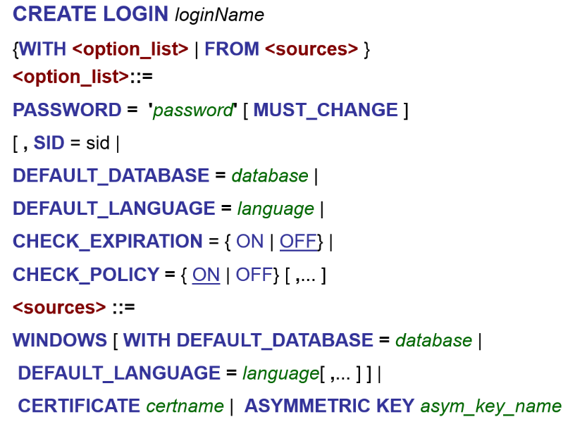

Пример SQL Server:
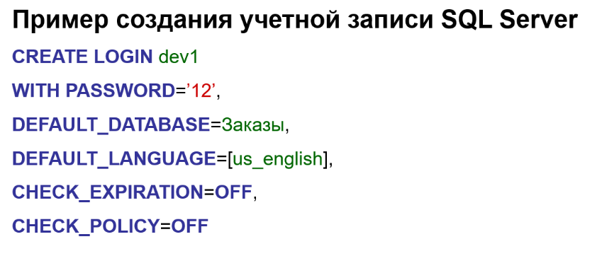

Пример Windows:
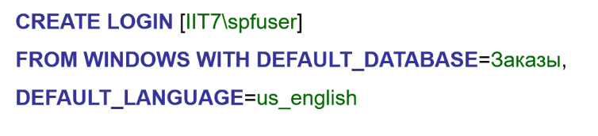

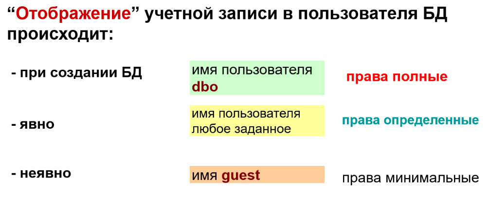

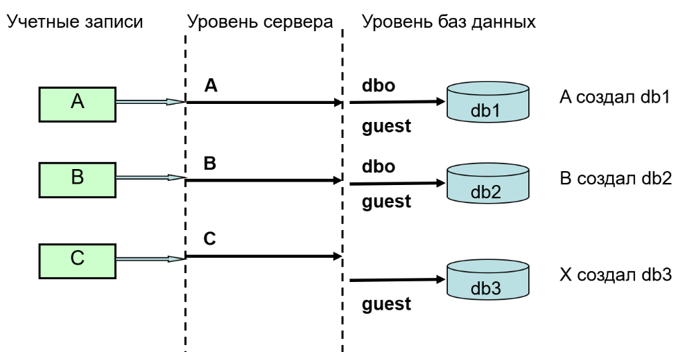

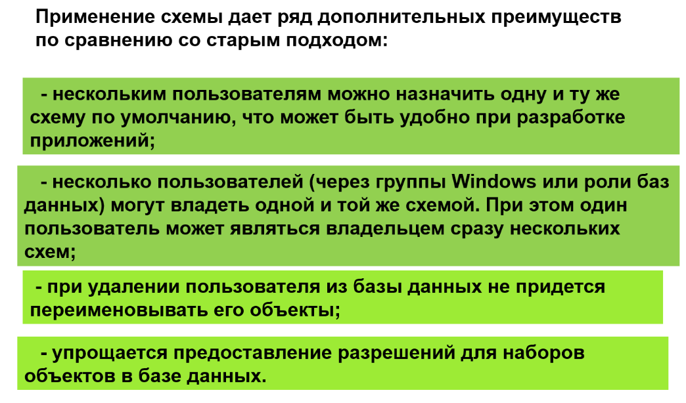

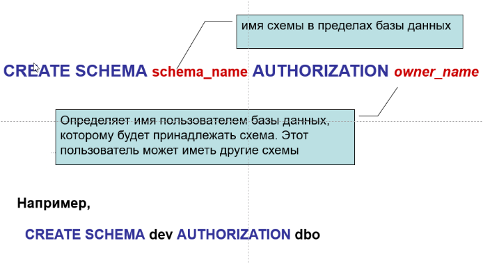

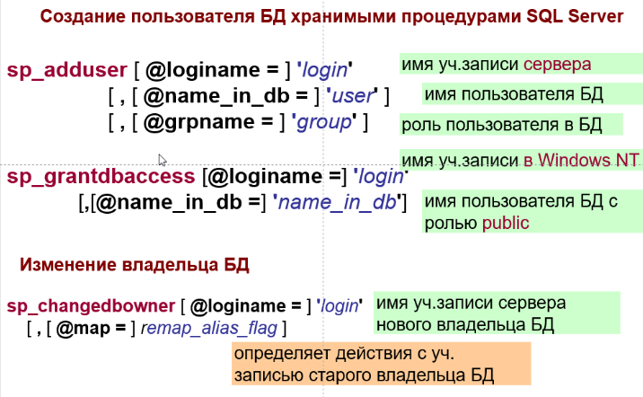

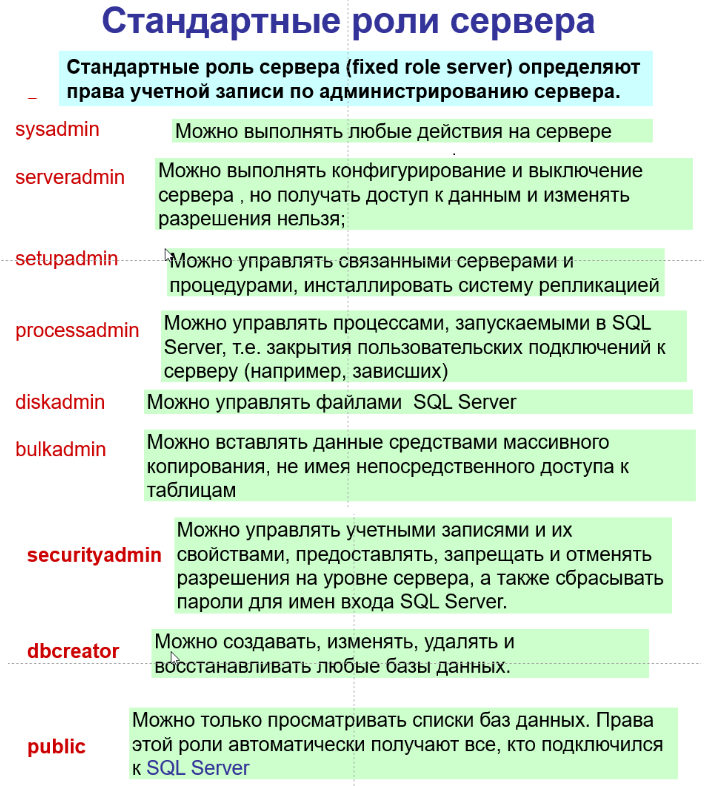

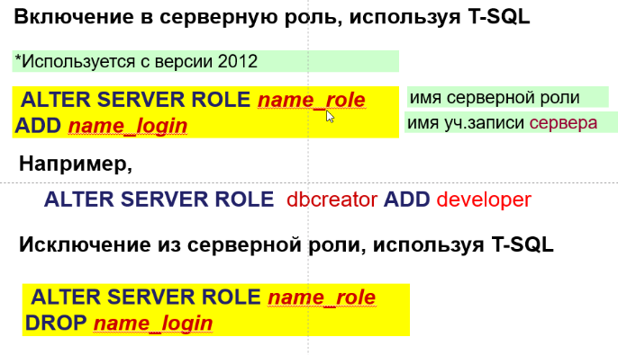

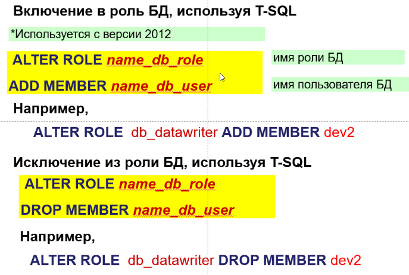

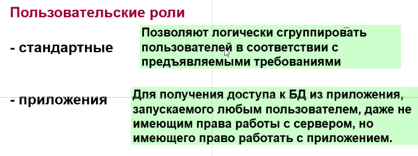

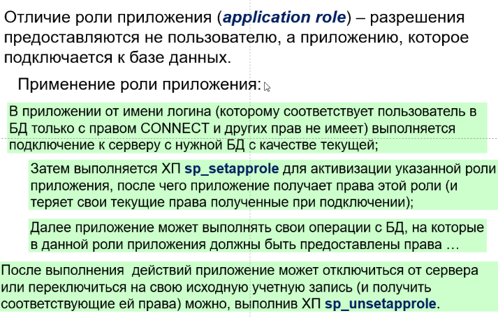

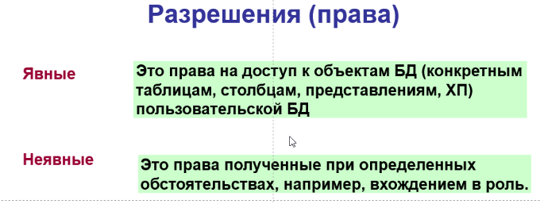

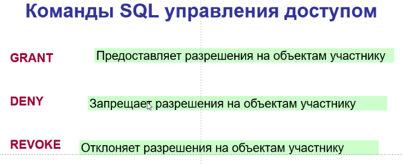

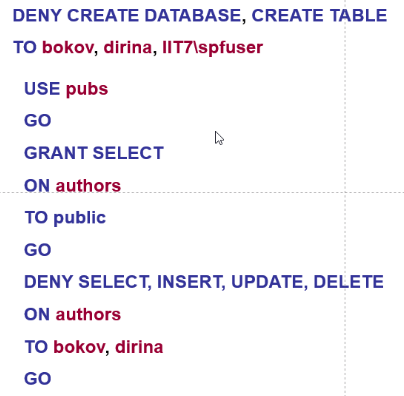