1 задание
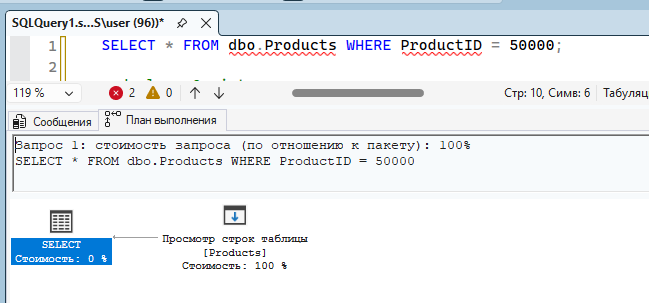
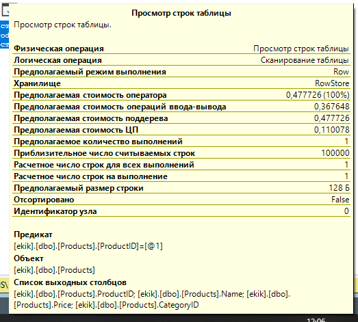

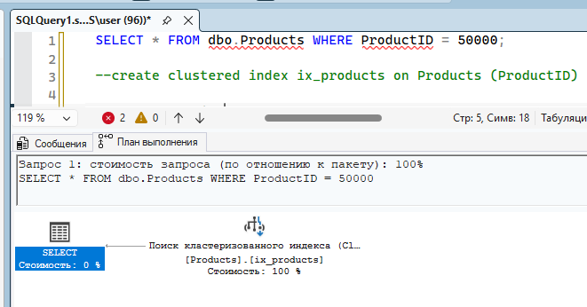
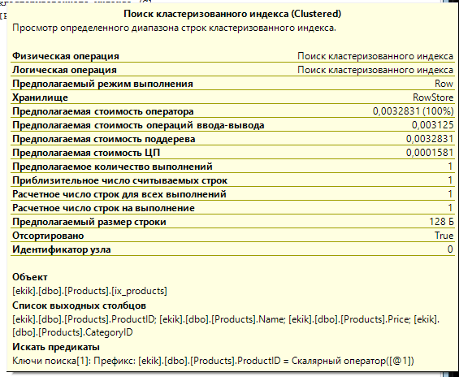

2 задание
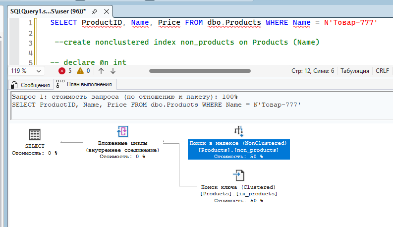

3 задание
    1. Происходит единичный поиск по индексу, так что используется обычный поиск, а не сканирование.
    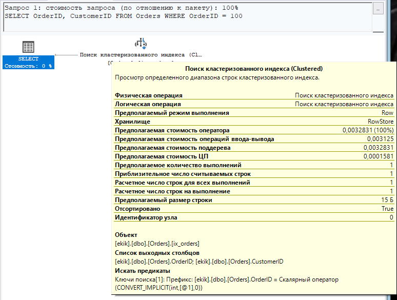
    2. Поиск происходит по диапазону, но этот диапазон сильно уже полного набора данных, так что использовать обычный поиск тут быстрее (ну или программа так считает хз). Программа просто сразу прыгает к индексу и читает до ограничительного второго индкеса
    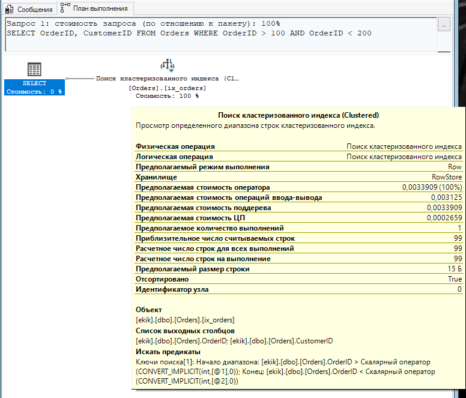
    3. Тут нужно просто прочитать все строки, так что последовательное чтение дешевле. Причём тут он ищет по некластеризованному индексу 
    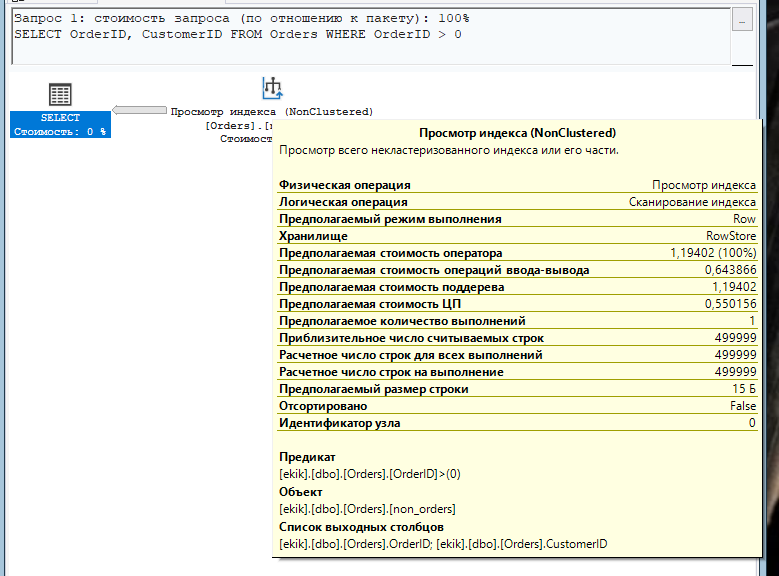

4 задание
    1. Тут игнорируется индекс поскольку легче просто пройтись по всем строкам, чем прыгать по страницам с помощью индексов (выборка 50% из вех строк)
    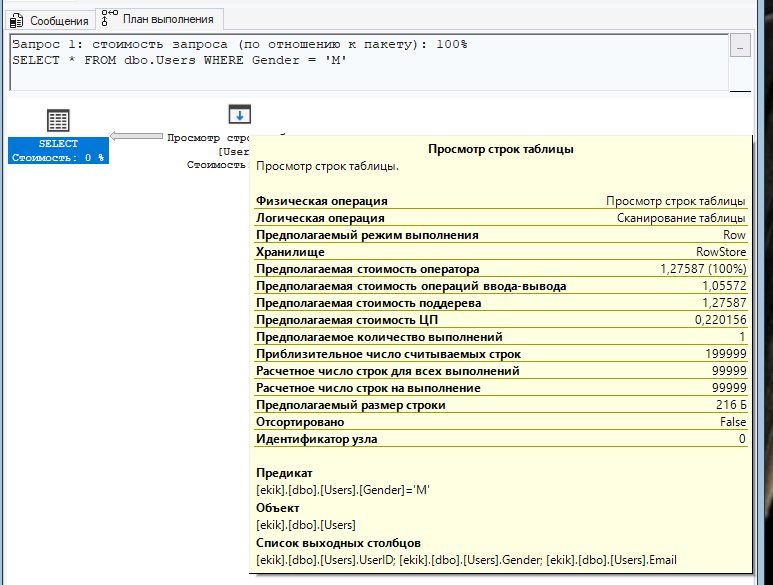
    2. Почта уникальная - происходит точечный поиск по индексу. Посколько SELECT выбирает все строки, то после нахождения почты ищутся ещё и связанные с ней столбцы (уточняющий запрос)
    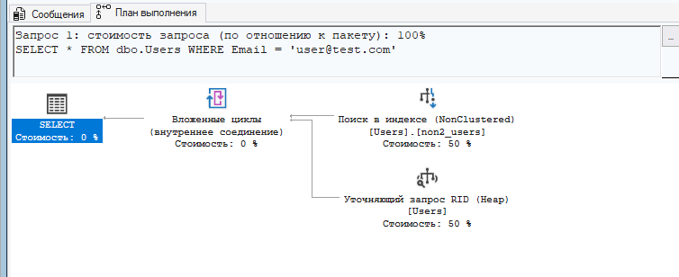

5 задание
    1. Создаём смотрим
    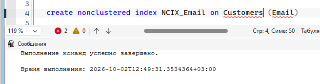
    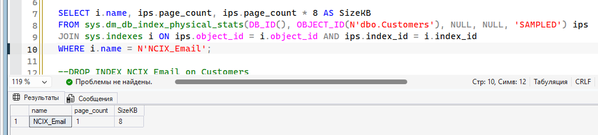
    2. Удаляем пересоздаём смотрим
    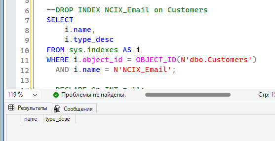
    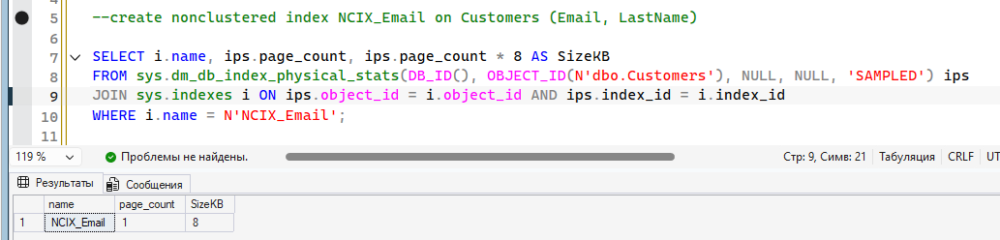

я ваще не поняла чота оно одинаковое я хз. запросы на прорсмотр у нейронки просила потому что видит бог я не понимаю этот арабский