=== ПРАКТИКА ===

Создание учётной записи MS SQL Server
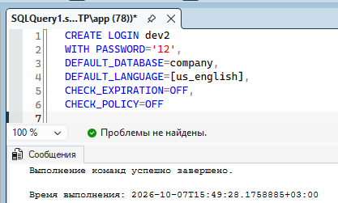

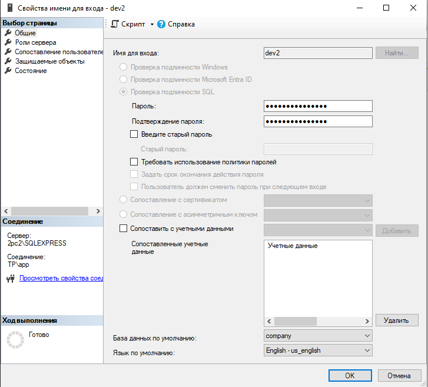

Создание учётной записи Windows NT
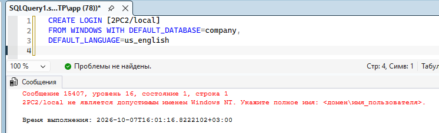
тут у меня нет прав, так что оно так и продолжит жаловаться

Создание учётной записи через хранимую процедуру
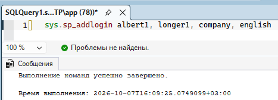
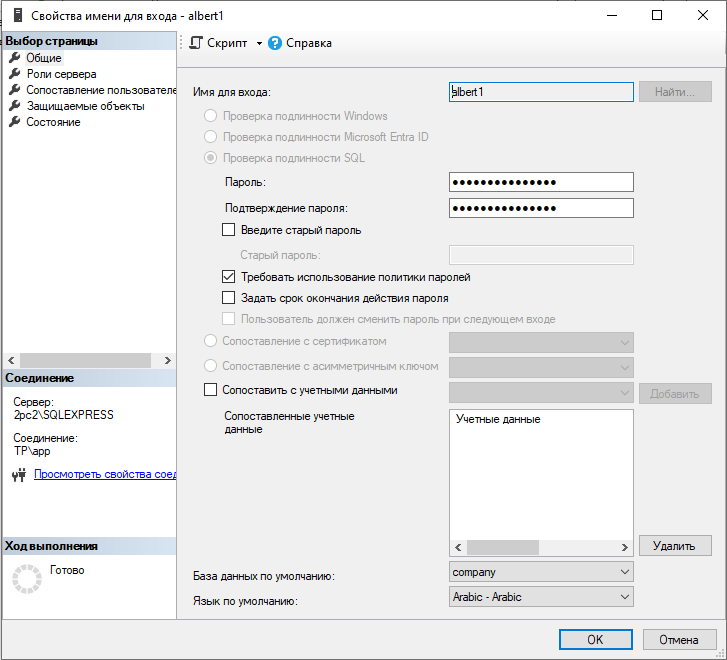

Тут есть примеры системных процедур
https://infocenter.sybase.com/help/index.jsp?topic=/com.sybase.dc36273_1251/html/sprocs/X25636.htm

Создание схемы
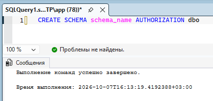
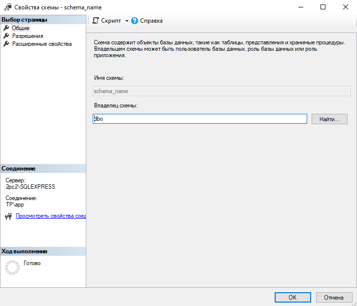

Создание пользователя БД
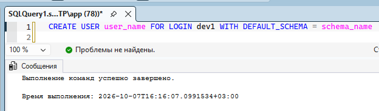
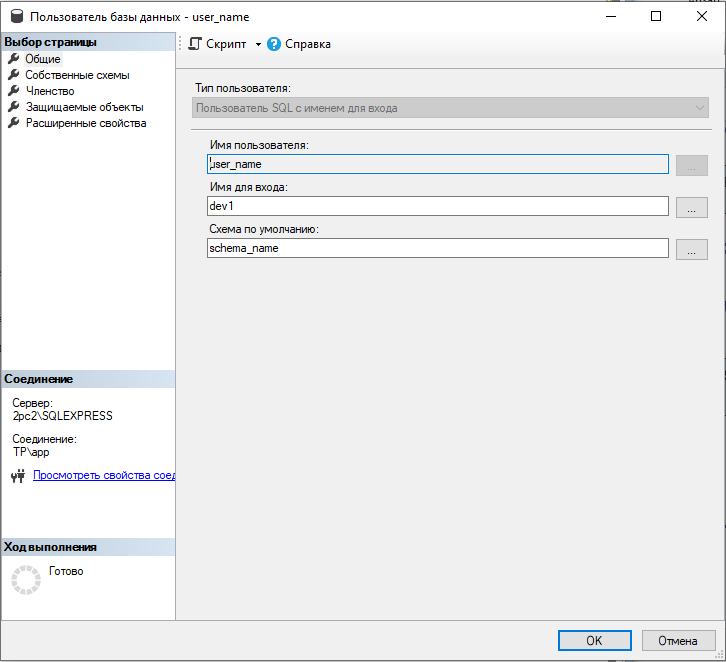

Создание пользователя БД с помощью хранимой процедуры

1. sp_adduser - можно задать роль пользователя через group_name
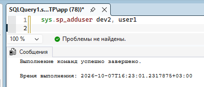
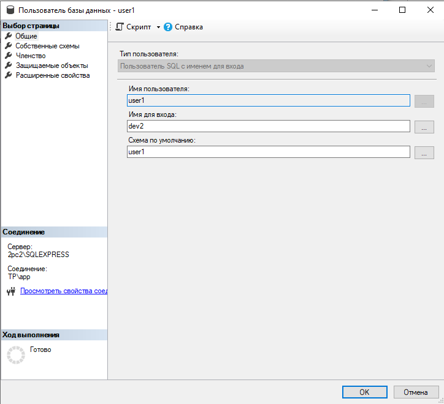

2. sp_grantbaccess - создаётся с ролью public
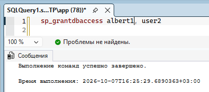
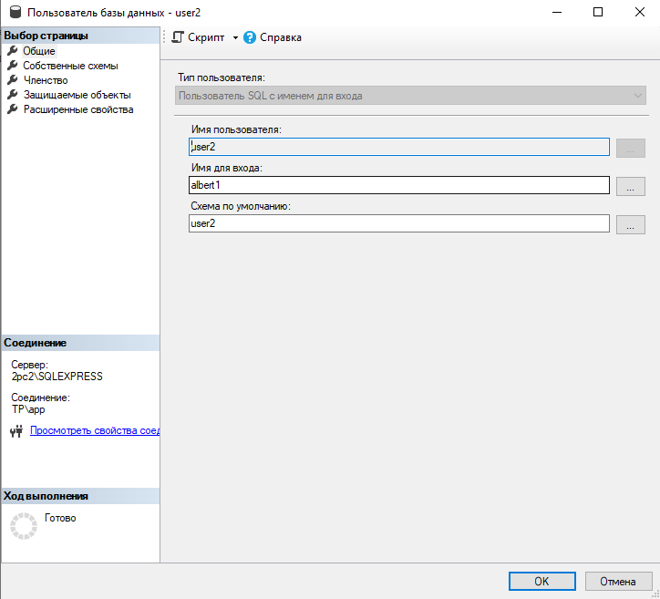